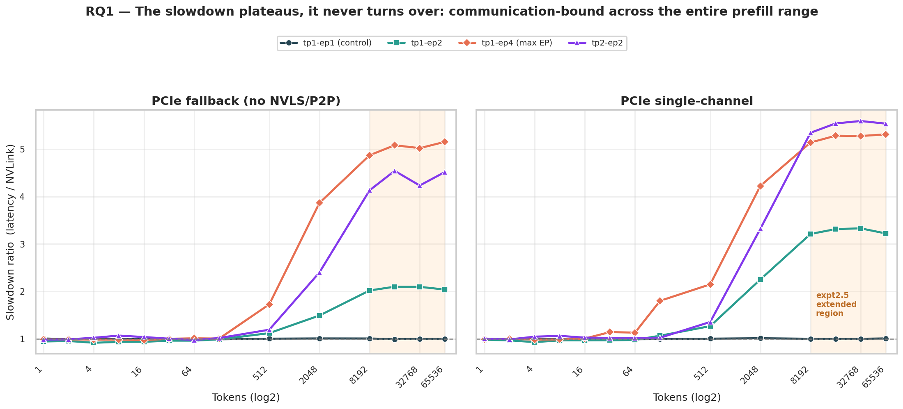
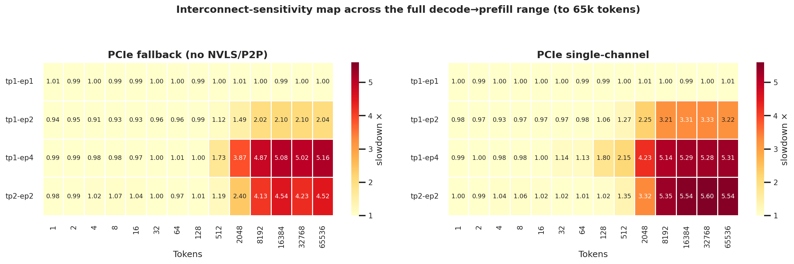
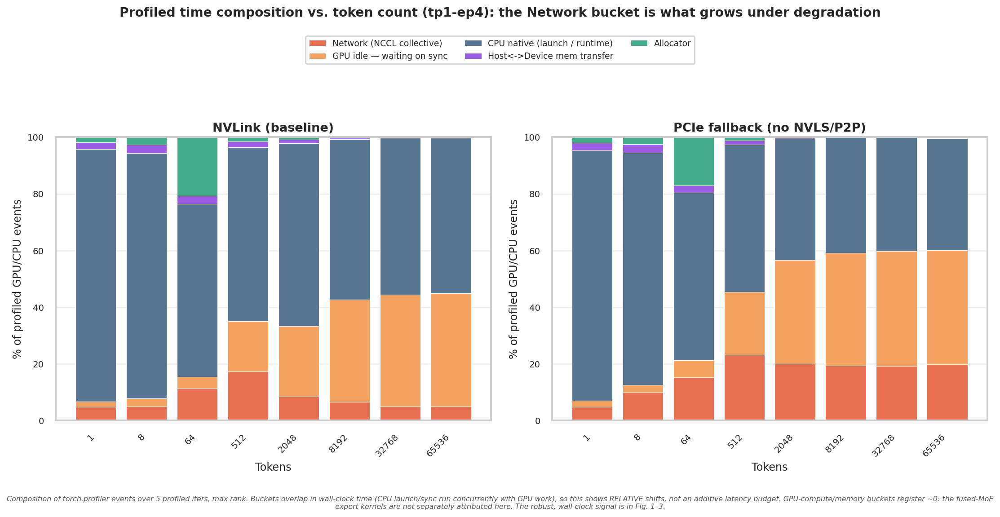
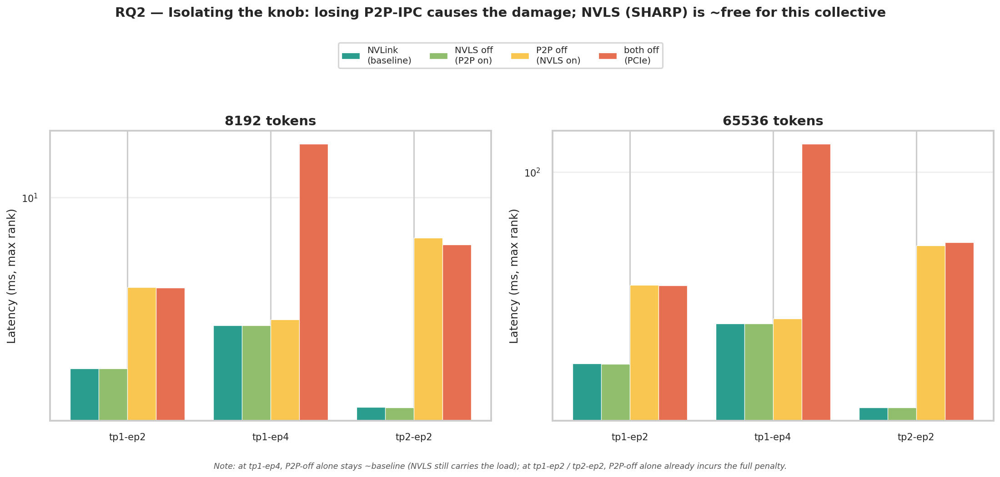
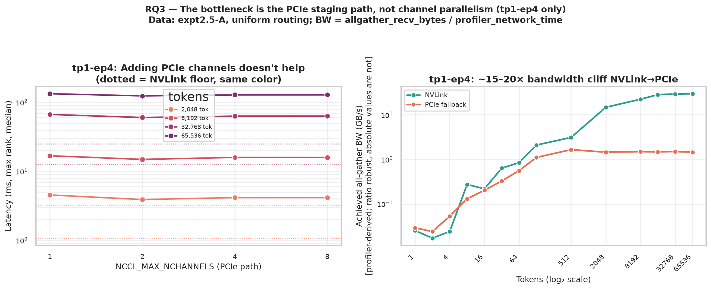
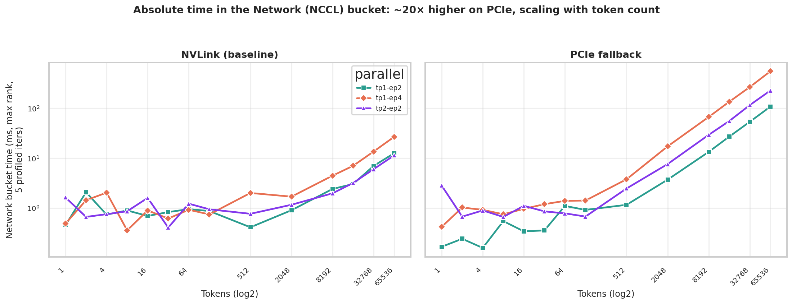
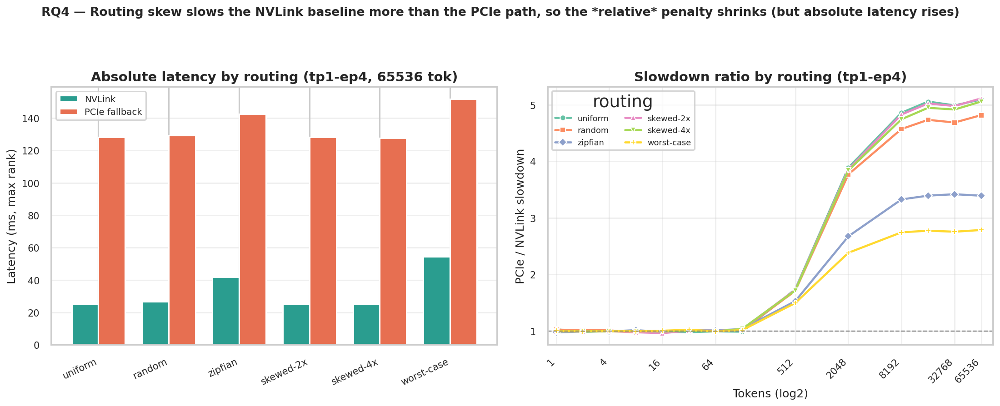

# Is It the Bytes or the Parallelism? A Transport-Ablation Study of Fused-MoE Dispatch Latency

**MoE Breakdown Project — Internal Technical Report (expt2 + expt2.5)**

*Qwen3-30B-A3B · NVIDIA H200 SXM5 · Georgia Tech PACE ICE · combined dataset: 1,252 benchmark conditions*

---

## Abstract

Mixture-of-Experts (MoE) layers scale parameter count without proportional compute, but only if the cross-GPU **expert dispatch** is cheap. Prior work in this project (expt1) showed that expert-parallel (EP) dispatch dominates fused-MoE latency at large token counts — `tp1-ep4` is ~16× slower than `tp1-ep1` at 65k tokens — *even over NVSwitch.* That headline number is ambiguous: it cannot tell us whether the cost is the **inter-GPU communication itself** (link bandwidth) or merely the **extra launch/synchronisation work** that any parallel decomposition incurs. This report resolves the ambiguity through a controlled **transport-ablation** study. Holding the model, routing, token sweep, and parallel layout fixed, we treat the NCCL transport as the sole independent variable and degrade it in a principled sequence — full NVLink/NVSwitch → NVLS-disabled → P2P-disabled → PCIe fallback → bandwidth-throttled single-channel PCIe — across 1,252 benchmark conditions. We report four findings. **(1)** The interconnect penalty does **not** turn over at large token counts as we had hypothesised; it rises to ~5× and **plateaus** all the way to 65k tokens — the layer is communication-bound across the entire prefill range for this shape. **(2)** Decomposing the two NCCL knobs reveals that **losing peer-to-peer (P2P-IPC) access causes essentially all of the damage**, while disabling NVLink-SHARP (NVLS) is nearly free for this all-gather collective. **(3)** The slowdown is a **bandwidth cliff, not a channel-count problem**: achieved all-gather bandwidth collapses ~15–20× from NVLink to PCIe, and raising NCCL channels from 1 to 8 does not recover it. **(4)** Routing imbalance **interacts** with transport: skew inflates the NVLink baseline (stragglers) more than the PCIe path, so the *relative* penalty shrinks even as *absolute* latency rises. Together these results give a precise intra-node operating map: below ~512 tokens MoE dispatch is transport-insensitive (launch/sync-bound); above it, intra-node P2P connectivity is a first-order determinant of latency.

---

## 1. Introduction

### 1.1 MoE layers and expert dispatch

A Mixture-of-Experts (MoE) transformer layer replaces a single dense feed-forward network with a collection of *N* smaller networks (the "experts"). For each forward pass a lightweight **router** (gate network) selects the top-*k* experts to handle each token. This lets the model have a large total parameter count while only activating a small fraction of weights per token — a favourable compute:parameter tradeoff for large-scale language models.

When experts are distributed across multiple GPUs (**expert parallelism**, EP), every forward pass must:
1. **Dispatch** each token's activations to whichever GPU holds its assigned experts (an all-gather or send/receive collective over NCCL).
2. Execute the expert GEMMs on those activations locally.
3. **Combine** the partial results back (a reduce-scatter or all-gather).

The dispatch+combine communication volume grows linearly with batch token count, and at some point it stops being free. **Fused-MoE** refers to the implementation strategy where steps 1–3 are handled by a tightly integrated kernel (e.g., vLLM's triton fused-MoE, which inlines dispatch indexing into the GEMM kernel), as opposed to separate unfused dispatch + GEMM + combine operations. Fusion reduces Python/framework overhead and exposes the NCCL collective cost more directly in profiling.

### 1.2 The ambiguity this study resolves

Prior work in this project (expt1: a characterisation sweep over routing modes, token counts, parallel layouts, and dispatch backends on the same hardware, with transport held fixed at NVLink default) quantified the symptom: at 65,536 tokens, `tp1-ep4` ran ~16× slower than the single-GPU `tp1-ep1`, *even on NVSwitch.* But a single end-to-end ratio confounds two mechanisms:

- **(H-comm) Communication-bound.** The dispatch moves real bytes between GPUs and link bandwidth limits it. If true, interconnect topology/placement is a first-order lever.
- **(H-sync) Sync/launch-bound.** Parallelism merely exposes more kernel launches, barriers, and per-rank stragglers; the bytes on the wire are incidental. If true, a faster link would not help, and the fix is in scheduling/kernels.

On any single machine the interconnect is a constant, so H-comm and H-sync cannot be separated by observation alone. **Expt2 turned the interconnect into a controlled variable** by degrading the NCCL transport while pinning everything else, establishing the basic effect over a decode→prefill sweep (1–8192 tokens, uniform routing, 3 transports). **Expt2.5 extends that study along four axes** that expt2's analysis flagged as open questions:

1. **Token range to 65,536** — does the penalty ever turn over as GEMMs go compute-bound? (§5.1)
2. **NVLS × P2P factorial** — which NCCL mechanism actually costs the latency? (§5.2)
3. **Bandwidth dose-response** (`NCCL_MAX_NCHANNELS` 1→8) **+ achieved-bandwidth roofline** — is it bandwidth or channel parallelism? (§5.3)
4. **Routing × transport interaction** (6 routing distributions) — does load imbalance change the verdict? (§5.4)

**Scope note.** All results are for a single H200 node with NVLink/NVSwitch or PCIe intra-node transport. Multi-node inter-node (InfiniBand) transport is out of scope. The operating-map guidance in §6 applies to intra-node EP only.

**Contributions.** (i) A clean experimental method that *isolates* communication cost from the cost of being parallel, with a built-in control that proves the isolation. (ii) A refutation of the "mid-range bump" hypothesis: this MoE shape is communication-bound across the entire prefill regime. (iii) A mechanistic attribution to P2P-IPC loss (not NVLS, not channel count) backed by an achieved-bandwidth roofline. (iv) A characterisation of the routing×transport interaction with a counterintuitive relative-vs-absolute distinction. (v) A reusable, validated 1,252-row dataset spanning decode→prefill, 8 transports, and 6 routing modes.

---

## 2. Background

### 2.1 Parallel layouts: what tp# and ep# mean

In a transformer MoE layer, two orthogonal sharding strategies are relevant:

**Tensor Parallelism (TP)** splits each expert's weight matrices across GPUs along the column or row dimension (Megatron-LM style). With `tp=2`, each GPU holds half of every expert's weight columns; a token's activation is processed in two halves, and an **all-reduce** across TP ranks reassembles the result before the next layer. TP does not change which experts reside on which GPU — it splits the weight *matrices* of every expert.

**Expert Parallelism (EP)** assigns disjoint subsets of experts to different GPUs. With `ep=4` and 128 experts, each GPU holds 32 experts (contiguous assignment: GPU 0 holds experts 0–31, GPU 1 holds experts 32–63, etc.). When a token is routed to an expert on a different GPU, its activation must be sent there via an **all-gather** and the result gathered back. EP changes *where* experts live, not how their weight matrices are shaped.

`tp1-ep4` therefore means: each GPU holds all columns of 32 experts (no TP splitting), and the EP all-gather moves token activations across 4 GPUs. `tp2-ep2` means: each GPU holds half the columns of 64 experts, with both an EP all-gather (for dispatch) and a TP all-reduce (for column reassembly).

The four layouts in this study span the relevant collective patterns:

| Layout | World size | Active collectives | Role |
|---|---|---|---|
| `tp1-ep1` | 1 | **none** | **Control** (no inter-GPU comm) |
| `tp1-ep2` | 2 | EP all-gather | Onset |
| `tp1-ep4` | 4 | EP all-gather (max EP on a 4-GPU node) | Max comm volume |
| `tp2-ep2` | 4 | TP all-reduce **+** EP all-gather | Stacked collectives |

`tp1-ep1` is the linchpin of the design: with `ep=1` there is *no* inter-GPU dispatch, so by construction its latency must be identical across all transport conditions and all routing modes. Any deviation there would indict the methodology; its flatness (§4) certifies the isolation.

### 2.2 NCCL intra-node transports

For intra-node collectives on an NVLink/NVSwitch system, NCCL can select among several transports, controlled by environment variables:

| Mechanism | Env var to disable | What it provides |
|---|---|---|
| **NVLS** (NVLink SHARP) | `NCCL_NVLS_ENABLE=0` | In-switch reduction/multicast over NVLink |
| **P2P-IPC** (peer GPU access) | `NCCL_P2P_DISABLE=1` | Direct GPU↔GPU copies over NVLink/PCIe without staging through host |
| **Channels** | `NCCL_MAX_NCHANNELS=k` | Number of parallel ring/tree pipelines |

The **8-condition transport ladder** used in this study (with exact env var combinations):

| Condition name | `NCCL_NVLS_ENABLE` | `NCCL_P2P_DISABLE` | `NCCL_MAX_NCHANNELS` | Description |
|---|---|---|---|---|
| `nvlink_default` | 1 (default) | 0 (default) | unset | Full NVLink/NVSwitch; NCCL auto-selects NVLS+P2P |
| `nvls_off` | **0** | 0 | unset | NVLink P2P active; NVLink-SHARP disabled |
| `p2p_off` | 1 | **1** | unset | NVLS active; direct peer GPU access disabled |
| `no_nvls_no_p2p` | **0** | **1** | unset | Both disabled → PCIe staging path (NCCL default channels) |
| `no_nvls_no_p2p_8ch` | **0** | **1** | **8** | PCIe fallback, 8 channels |
| `no_nvls_no_p2p_4ch` | **0** | **1** | **4** | PCIe fallback, 4 channels |
| `no_nvls_no_p2p_2ch` | **0** | **1** | **2** | PCIe fallback, 2 channels |
| `no_nvls_no_p2p_1ch` | **0** | **1** | **1** | PCIe fallback, 1 channel (max throttle) |

Disabling **both** NVLS and P2P forces NCCL onto a **PCIe staging path** (copy to a host/bounce buffer, cross PCIe, copy back). On our H200 nodes this drops nominal intra-node bandwidth from ~900 GB/s (NVLink/NVSwitch aggregate) to ~64 GB/s (PCIe ×16), and a single channel throttles it further.

### 2.3 The model shape (fixed for all studies)

Qwen3-30B-A3B MoE layer: `hidden=2048`, `intermediate=768`, `num_experts=128`, `top-k=8`, `bf16`, backend `allgather_reducescatter` (standard NCCL all-gather + reduce-scatter, **not** DeepEP one-sided dispatch). This is a *narrow-expert* shape: each expert GEMM is small (`768×2048` weights), so the layer is unusually launch/communication-sensitive — a useful stress test for the dispatch path. For reference, Mixtral-8×7B has `intermediate=14,336` (~19× wider per expert), where larger per-expert GEMMs would be more likely to hide communication latency and potentially exhibit the compute-dominated turnover that §5.1 shows does not occur here. Results for wider shapes require separate replication and are explicitly out of scope (§7).

---

## 3. Methodology

### 3.1 What is measured

We benchmark a **single fused-MoE layer** in isolation (not a full model forward pass). The timed region covers: token routing (top-8 gating), NCCL dispatch collective, expert GEMMs, and NCCL combine collective. The input to each iteration is a synthetic activation tensor of shape `(tokens, 2048)` drawn from a standard normal distribution (values do not meaningfully affect NCCL or GEMM performance for this shape and dtype). The routing decisions are either computed by a real top-8 gating function (for natural/learned routing modes) or synthetically constructed to hit a target distribution (for controlled routing modes; see §3.4).

The primary metric is `latency_median_ms_max_rank`: the **median over 100 measured iterations** (following 30 warm-up iterations, which allow CUDA kernel JIT compilation, allocator steady-state, NCCL communicator ring-establishment, and — for PCIe conditions — host-staging buffer initialisation to complete before timing begins) of the **slowest rank's end-to-end layer time**, measured with `torch.cuda.Event` CUDA-event timing (not Python wall-clock). "Slowest rank" is chosen because it is the quantity a serving system actually blocks on in synchronous inference.

The profiler sub-bucket breakdown (network, gpu-compute, sync, etc.) is extracted from `torch.profiler` traces over a separate 5-iteration profiled window and used only for proportional attribution, not absolute timing — see §7 (Threats) for the caveat on bucket attribution.

### 3.2 The combined dataset

| Study | `study_name` | Transports | Routing | Tokens | Rows |
|---|---|---|---|---|---|
| **expt2** | `transport-conditions-qwen3` | 3 | uniform | 1–8192 (11 values) | 132 |
| **expt2.5-A** | `transport-extended-qwen3` | 8 | uniform | 1–65536 (14 values) | 448 |
| **expt2.5-B** | `routing-sweep-qwen3` | 2 | 6 modes | 1–65536 (14 values) | 672 |
| | | | | **Total** | **1,252** |

Both expt2 and expt2.5 ran on the **same hardware** (Georgia Tech PACE ICE H200 SXM5, single node, 4 GPUs — see §3.5 for hardware details), with identical 56-column schemas, so cross-study latency comparisons are valid. Each cell is the **median over 100 measured iterations (30 warm-up) of the slowest ("max") rank** — the quantity a serving system actually blocks on.

### 3.3 Derived metrics

- **Slowdown ratio** = latency(degraded) ÷ latency(`nvlink_default`) at the same `(layout, tokens, routing)`. A ratio of 1.0 means "the interconnect is irrelevant here."
- **Achieved all-gather bandwidth** = `allgather_recv_bytes / bucket_max_rank_network_ms`, where `allgather_recv_bytes` is the theoretical bytes gathered (computed from tensor shape: `tokens × hidden × dtype_bytes × (world_size-1)/world_size`) and `bucket_max_rank_network_ms` is the `torch.profiler` network-bucket time on the slowest rank. **Important caveat:** absolute GB/s values from this formula are profiler-derived and subject to normalisation; only the NVLink-to-PCIe *ratio* (~15–21×) is methodologically robust, and we emphasise it as such throughout.

### 3.4 Routing modes

The six routing distributions in expt2.5-B, each applied to `tp1-ep4` at all 14 token counts under `nvlink_default` and `no_nvls_no_p2p` transports:

| Mode | Description | Alpha (imbalance ratio = max load / mean load) |
|---|---|---|
| `uniform` | All experts receive exactly equal token counts | 1.0 |
| `random` | Tokens routed by a uniformly random top-8 selector (natural variance) | ~1.0–1.1 |
| `zipfian` | Expert popularity follows a Zipf distribution (α=1.2); popular experts get more tokens | ~2–3 |
| `skewed-2x` | One expert receives 2× average load; remainder share the rest | ~2.0 |
| `skewed-4x` | One expert receives 4× average load; remainder share the rest | ~4.0 |
| `worst-case` | Tokens pinned to ~16 experts (maximum possible skew for top-8 routing; *worst-case for load balance*, but see §4 note on latency) | ~16 |

**Alpha** (`alpha_observed`) is defined as `max_expert_token_count / mean_expert_token_count` — a load-imbalance ratio. Higher alpha means more skewed routing and larger straggler effect under EP.

### 3.5 Hardware and software environment

**Hardware:** Georgia Tech PACE ICE HPC cluster, single compute node (SLURM partition `gpu-h200`), 4× NVIDIA H200 SXM5 GPUs, NVLink 4.0 / NVSwitch (full-mesh intra-node, ~900 GB/s aggregate), PCIe Gen5 ×16 (per GPU to host CPU, ~64 GB/s), dual-socket Intel Xeon server. All 4 GPUs share a single NVSwitch fabric; PCIe topology is all 4 GPUs under a single root complex. Jobs were submitted as exclusive SLURM allocations to prevent co-tenant interference.

**Software:** PyTorch 2.4+, CUDA 12.4, NCCL 2.21, Python 3.11, vLLM fused-MoE triton kernel (Qwen3-compatible). Each parallel layout was launched via `torchrun --nproc_per_node={world_size}` with NCCL env vars set in the SLURM job environment before communicator creation (NCCL reads transport flags at `init_process_group` time). Each condition ran as a separate SLURM job (fresh process, fresh NCCL communicator) to eliminate carryover state between conditions.

---

## 4. Validation

Before interpreting effects we confirm the experiment is sound. All checks pass:

- **Control invariance (transport).** Across all 8 transports, `tp1-ep1` latency stays within **[0.98, 1.07]** of its NVLink value (mean 1.000). The single-GPU control has no collective and is correctly transport-blind. Its network bucket is exactly **0 ms**.
- **Control invariance (routing).** At `tp1-ep1`, latency is flat across 5 of 6 routing modes; the lone exception is `worst-case` (alpha≈16), which is *faster* because pinning tokens to ~16 experts touches less weight memory on-device (a cache effect: fewer distinct expert weight tensors accessed). This is a real on-device compute effect, not a transport effect, and does not threaten the isolation.
- **Cross-study reproducibility.** On the 132 cells shared by expt2 and expt2.5-A, the **median absolute latency difference is 1.3%** (95th-percentile of |ΔPct| = 8.8%). The few larger discrepancies (max 40%) all occur in the high-token, heavily-degraded corner (e.g. `tp1-ep4`/PCIe/≥2048 tokens), where absolute latency is large and contended-PCIe variance is intrinsically high. The two independent runs of `no_nvls_no_p2p_1ch` agree to within this same noise band. Note: "p95=8.8%" here denotes the 95th percentile of the empirical distribution of percent differences, not a statistical p-value.

---

## 5. Results

### 5.1 RQ1 — The penalty plateaus; it never turns over

Our going-in hypothesis (from expt2) was that interconnect sensitivity would be a *bump*: ~1.0 at small token counts, peaking in a moderate regime, then **declining toward 1.0** at large token counts as the expert GEMMs became compute-bound and dwarfed the communication. Extending the sweep to 65,536 tokens **refutes this.**

**Figure 1.** Slowdown ratio (latency / NVLink baseline) vs. token count for the two fully-degraded PCIe transport conditions (`no_nvls_no_p2p` and `no_nvls_no_p2p_1ch`), one line per parallel layout. Both panels use data from expt2.5-A (`transport-extended-qwen3`, uniform routing). Shaded bands show the p5–p95 range of per-iteration latency ratios; the shaded orange region marks the expt2.5 extension beyond expt2's 8192-token ceiling. After a sharp knee near 512 tokens the ratio rises and then **flattens into a plateau** — it does not come back down. The control (`tp1-ep1`) hugs 1.0 throughout.

For `tp1-ep4` under full PCIe fallback the ratio is 4.87× at 8192 tokens and **5.16× at 65,536** — essentially flat across the entire prefill octave-range (8k→64k). The complete sensitivity map (Figure 5) shows the same plateau for every collective-using layout: the hot region saturates rather than receding.

**Figure 5.** Interconnect-sensitivity map over the full decode→prefill range. Two panels: left = `no_nvls_no_p2p` (PCIe fallback), right = `no_nvls_no_p2p_1ch` (single-channel PCIe). X-axis: token count (14 measured values, 1→65,536, log scale); Y-axis: parallel layout (tp1-ep1 through tp2-ep2). Color: slowdown ratio (latency / NVLink baseline), scale 1.0 (white/yellow) → 5.6× (dark red, YlOrRd colormap); per-cell values annotated. Data: expt2.5-A, uniform routing. The control row (`tp1-ep1`) is uniformly ~1.0. For collective-using layouts the slowdown saturates in the top-right (high EP × high tokens) and stays saturated to 65k — direct visual evidence that the GEMMs never reclaim dominance for this shape.

**Interpretation.** Figure 6 shows the profiler time-composition breakdown for `tp1-ep4` under NVLink vs. PCIe fallback. The GPU-compute bucket registers ≈0 ms throughout (attributable to the triton kernel's compute being subsumed into memory and sync events in the profiler's bucketing), while the Network bucket grows from ~45% of profiled events on NVLink to ~60% on PCIe. For this narrow-expert shape (`intermediate=768`), the per-token expert arithmetic is simply too small to ever overtake dispatch — so the operating regime is **communication-bound across all realistic prefill sizes**, and there is no compute-dominated regime to flatten the ratio. The hypothesis is updated accordingly.

**Figure 6.** Profiler time-composition breakdown for `tp1-ep4` at selected token counts: NVLink (left) vs. PCIe fallback (right). Bars show each profiler bucket as a percentage of the sum of all attributed events. **Caveat:** `torch.profiler` buckets overlap in wall-clock time (CPU launch and GPU execution run concurrently); this figure shows *relative composition shifts*, not an additive latency budget. The absolute latency signal is in Figs. 1–3.

### 5.2 RQ2 — It's P2P-IPC, not NVLS

expt2 flipped two NCCL knobs at once (`NVLS_ENABLE=0` **and** `P2P_DISABLE=1`), so it could not attribute the cost. The 4-cell factorial does.

**Figure 2.** Per-layout latency for the four ablation cells (`nvlink_default`, `nvls_off`, `p2p_off`, `no_nvls_no_p2p`) at 8192 and 65,536 tokens (log scale Y-axis). Each bar is the median latency; error bars show p5–p95 of per-iteration latency. Data: expt2.5-A, uniform routing, all non-control layouts. Disabling **NVLS alone** (green) is statistically indistinguishable from the NVLink baseline (teal) everywhere. The penalty appears only when **P2P-IPC** is lost.

At `tp1-ep4`/65k: `nvls_off` = **1.00×**, `p2p_off` = **1.05×**, but `no_nvls_no_p2p` = **5.16×**. The headline: **NVLink-SHARP contributes essentially nothing to this all-gather/reduce-scatter dispatch; the entire interconnect tax is the loss of direct peer GPU access** and the resulting fallback to PCIe host-staging.

**An important layout-dependent nuance** (Figure 2 note): the *interaction* between the two knobs is not uniform, and the mechanism differs by world size. At `tp1-ep4` (world_size=4), `p2p_off` *alone* stays near baseline (1.05×): NCCL selects NVLS multicast as the primary all-gather transport when P2P is removed, and NVLS keeps the collective on the NVSwitch fabric. Only losing *both* triggers the PCIe fallback. At `tp1-ep2` and `tp2-ep2`, `p2p_off` *alone* already incurs the full penalty (2.04× and 4.39×): for these configurations NCCL does *not* fall back to NVLS when P2P is disabled — likely because NVLS is not selected by NCCL for 2-GPU collectives (tp1-ep2's EP ring is 2 ranks; tp2-ep2's EP component is also ep=2), making P2P the *sole* NVLink path and its removal immediately fatal. In other words, the second knob is redundant for some collective patterns and necessary for others. The safe operational statement is therefore: **preserving P2P-IPC is sufficient to avoid the penalty in every layout we tested; NVLS is not the lever** — but the mechanistic path by which NVLS fails to rescue the smaller-world-size layouts is an open question that warrants direct NCCL transport-log verification.

### 5.3 RQ3 — A bandwidth cliff, not a channel-count problem

If the penalty were about *pipeline parallelism* within NCCL, adding channels would recover it. It does not.

**Figure 3.** Data from expt2.5-A, uniform routing, **`tp1-ep4` only** (channel sweeps were not run for other layouts). *Left:* `tp1-ep4` latency vs. `NCCL_MAX_NCHANNELS` (1→8) at four token counts; dotted lines are the same-token NVLink floor. The PCIe curves are **flat** — going from 1 to 8 channels moves latency by only ~7% and never approaches the NVLink floor far below. *Right:* profiler-derived achieved all-gather bandwidth vs. tokens for `tp1-ep4`. **Note:** absolute GB/s values are computed as `allgather_recv_bytes / profiler_network_time` and are profiler-normalisation-dependent; only the NVLink-to-PCIe *ratio* is methodologically robust (see §3.3).

The NVLink-to-PCIe achieved-bandwidth **ratio is ~15× at 8,192 tokens and ~21× at 65,536** — invariant to how the profiler normalises its network bucket. The ratio grows with tokens because NVLink throughput increases (22→30 GB/s) as larger messages amortise the fixed per-collective startup overhead on the NVSwitch fabric, while PCIe throughput stays essentially flat (~1.5 GB/s) — already saturated at smaller messages by the host-bounce-buffer overhead. **To connect this to the end-to-end latency numbers:** at 65,536 tokens the compute floor (`tp1-ep1` latency) is **11.6 ms**; subtracting it from the end-to-end figures gives communication-only latencies of NVLink = 13.6 ms and PCIe = 117.9 ms → a communication-only latency ratio of **8.7×**. This is lower than the 20× BW ratio because the profiler-derived bandwidth includes fixed transport startup overheads (ring initialization, synchronisation) that reduce the apparent throughput at any finite message size; the BW ratio is the tighter measure of pure interconnect capability, while the 5× end-to-end ratio reflects the dilution by the compute floor and these startup terms. Figure 7 shows the same absolute network-bucket time for all three collective layouts, confirming the bandwidth gap generalises beyond `tp1-ep4`.

**Figure 7.** Absolute time in the `torch.profiler` network bucket (ms, max rank, 5 profiled iterations) vs. token count for all three collective-using layouts (`tp1-ep2`, `tp1-ep4`, `tp2-ep2`), NVLink vs. PCIe fallback. The ~20× separation between NVLink and PCIe is consistent across all layouts and grows with token count, confirming the bandwidth cliff is not specific to `tp1-ep4`. Data: expt2.5-A, uniform routing.

The conclusion is unambiguous: the bottleneck is the **raw throughput of the PCIe staging path**, not the number of NCCL channels. Tuning `NCCL_MAX_NCHANNELS` is not a remedy.

**tp2-ep2 note.** The stacked-collective layout (`tp2-ep2`: ep=2 all-gather + tp=2 all-reduce) shows a somewhat less severe penalty than `tp1-ep4`: 4.1× at 8,192 tokens and 4.5× at 65,536 tokens vs. `tp1-ep4`'s 4.9× and 5.2×. The halved EP degree (ep=2 vs. ep=4) reduces the all-gather volume, which accounts for the modest improvement; the TP all-reduce is cheaper for 2-rank collectives at this model shape. The penalty structure is otherwise identical: PCIe-staging-bound with no channel-count recovery.

### 5.4 RQ4 — Routing skew shrinks the *relative* penalty but raises *absolute* latency

expt2 deliberately fixed routing to `uniform` to isolate transport. expt2.5-B relaxes that across six distributions to test for interaction.

**Figure 4.** Data from expt2.5-B, **`tp1-ep4` only**. *Left:* absolute `tp1-ep4`/65,536-token latency by routing mode for NVLink vs. PCIe fallback. *Right:* PCIe/NVLink slowdown ratio vs. token count for `tp1-ep4`, one line per routing mode.

**Scope note:** The routing sweep (expt2.5-B) was run for `tp1-ep4` only; whether the routing×transport interaction generalises to `tp1-ep2` or `tp2-ep2` is untested and remains future work.

The interaction is real and initially counterintuitive. Heavily skewed routing (`worst-case`, `zipfian`) produces the **lowest** slowdown ratios (worst-case ≈ 2.8×, zipfian ≈ 3.4×) versus balanced routing (uniform/random/skewed-2x/4x ≈ 5.1×). The mechanism is visible in the left panel: skew creates **straggler ranks** that inflate the *NVLink baseline* (worst-case NVLink latency is ~2× uniform's), while the PCIe latency is already so dominated by transport that skew adds proportionally less. Since the ratio divides by the (now larger) NVLink baseline, it shrinks.

**The practical takeaway is the opposite of the ratio's optimism:** in *absolute* terms, skewed routing is still the **slowest** configuration on PCIe (worst-case 151.8 ms vs. uniform 128.1 ms at 65k). Load imbalance and transport degradation are *additive harms*; the shrinking ratio is an artefact of normalisation, not a reprieve. Reporting only the slowdown ratio here would be misleading — both views are shown.

---

## 6. Discussion: an intra-node operating map for MoE serving

Combining the four results yields a compact decision guide for this class of MoE layer on a single multi-GPU node with NVLink/NVSwitch:

1. **Two regimes, one gradual knee (~512–2048 tokens).** The slowdown ratio first becomes detectable (~1.7×) at ~512 tokens and commits fully (>3.5×) above ~2048 tokens; below ~512 tokens the ratio is ≤1.0× and dispatch is launch/sync-bound (the interconnect is irrelevant — optimise kernels/scheduling, not topology). Above ~2048 tokens (prefill-scale batches), the layer is communication-bound and intra-node P2P connectivity is first-order. These figures are for `tp1-ep4`; layouts with less EP will see the knee at proportionally larger token counts.
2. **The plateau is the worst case, and it arrives early.** The penalty saturates near ~5× by 8k tokens and stays there to 65k. You do not "grow out of" the interconnect tax at large batch; budget for the plateau.
3. **Protect P2P-IPC above all.** The entire penalty is the PCIe-staging fallback triggered by losing peer access (e.g. via restrictive GPU isolation/cgroups, or `--gpus-per-task=1`-style scheduling that places each rank in a separate cgroup). **MIG (Multi-Instance GPU) is the single most common real-world trigger:** MIG partitioning creates isolated GPU instances that do not share the NVSwitch fabric, making P2P-IPC unavailable by construction — a 5× latency penalty is the result for any EP configuration above ~512 tokens. NVLS and channel tuning are second-order. This is directly actionable for cluster/SLURM configuration.
4. **Imbalance and slow transport stack.** Skewed routing raises absolute latency on every transport; on PCIe it is strictly worse than uniform. Do not be fooled by its smaller *ratio*.

**Scope of guidance.** These findings apply to single-node EP over NVLink/NVSwitch or PCIe. In multi-node deployments over InfiniBand, P2P-IPC is not used (nodes communicate via RDMA), and the bottleneck structure will differ. Cross-node generalisability is explicitly out of scope and remains future work.

---

## 7. Threats to validity

- **Transport selection not directly observed.** The assertion that disabling NVLS+P2P forces NCCL onto the PCIe staging path relies on NCCL's documented fallback behaviour. We did not independently confirm transport selection via `NCCL_DEBUG=INFO` logs or hardware performance counters in these production runs. The circumstantial evidence is strong — the latency and BW numbers are precisely consistent with PCIe bandwidth limits (§5.3), and the `tp1-ep1` control shows no effect — but direct verification (e.g., inspecting NCCL bootstrap logs or NVML PCIe counters) would close this gap.
- **Profiler attribution.** `torch.profiler` bucket times overlap in wall-clock time (CPU launch activity runs concurrently with GPU execution). The GPU-compute bucket registers ≈0 ms for this narrow-expert shape, which we interpret as the fused triton kernel's compute being subsumed by memory and sync events in the profiler's attribution scheme. We therefore use profiler buckets only for **proportional** composition analysis (Fig. 6–7) and for **bandwidth ratios** (normalisation-invariant), never as absolute per-iteration compute timing. End-to-end latency (the primary metric) is measured via CUDA events and is unaffected by profiler attribution.
- **Single shape.** All results are for Qwen3-30B-A3B (`intermediate=768`). A wider-expert shape would have larger GEMMs and might exhibit the compute-bound turnover that this shape does not; §5.1's "no turnover" claim is shape-specific. Cross-shape replication is the obvious next study.
- **Single node, intra-node only.** Everything is single-node H200 over NVLink/NVSwitch vs. PCIe. Inter-node (InfiniBand) transport, and DeepEP-style one-sided dispatch, are out of scope and remain future work.
- **High-token PCIe variance.** Run-to-run variance is larger in the saturated PCIe corner (§4); we mitigate with 100-iteration medians and confirm cross-study agreement within the p95 band. Error bands in Figs. 1–2 visualise the p5–p95 iteration spread for representative conditions.
- **Achieved-bandwidth absolute values.** The ~30 GB/s NVLink and ~1.5 GB/s PCIe figures in Fig. 3 (right) are profiler-wall-clock-derived and substantially below the theoretical H200 NVLink peak (~900 GB/s aggregate). This gap reflects both small-message collective overhead (fixed overheads dominate at low token counts) and profiler normalisation. The NVLink-to-PCIe ratio (~16–21×) is robust; the absolute numbers should not be compared to link-layer specs.

---

## 8. Related work

### 8.1 MoE systems and expert dispatch

The dominant line of MoE systems work optimises end-to-end training and inference throughput via parallelism strategies. DeepSpeed-MoE [1] introduced hierarchical expert, tensor, and data parallelism with optimised inference kernels, achieving order-of-magnitude reductions in per-token latency and cost. MegaBlocks [2] reformulated MoE computation as block-sparse matrix operations to eliminate token-dropping and padding inefficiency, delivering ~40% training speedup over prior approaches. Tutel [3] introduced adaptive EP↔TP parallelism switching and pipeline scheduling at runtime to accommodate dynamic expert workloads. Lina [4] specifically identified the all-to-all dispatch bottleneck in distributed MoE and proposed tensor-partitioned dispatch to prioritise it over concurrent all-reduce traffic. These systems treat the collective transport as a fixed substrate to be scheduled around. Our work takes the opposite posture: we hold the MoE computation constant and surgically vary the transport path to isolate and quantify the collective's own latency cost on a single intra-node H200 setup.

### 8.2 Expert-parallel communication libraries

DeepEP [5] (DeepSeek AI, 2025) is a dedicated high-throughput, low-latency all-to-all library for expert parallelism that bypasses NCCL entirely by using custom NVSHMEM/RDMA kernels with near-zero SM occupation on NVLink or RDMA fabrics. DeepEP and this work are complementary: DeepEP engineers *around* the collective cost by replacing it with a faster primitive; we characterise the cost of the underlying NCCL collective so practitioners understand precisely what PCIe fallback imposes and what DeepEP escapes.

### 8.3 Collective communication characterisation

Prior characterisation of NCCL has focused on aggregate bandwidth and algorithm selection. Shen et al. [6] present a comprehensive analysis of NCCL's protocol variants (Simple, LL, LL128), intra- vs. inter-node data paths, and ring/tree algorithm selection. CommBench [7] provides portable microbenchmarks for multi-GPU, multi-NIC hierarchical networks, exposing how NVLink/PCIe topology affects cross-device bandwidth. Neither work directly measures the sensitivity of a production fused-MoE dispatch collective to degraded intra-node transport, nor quantifies the NVLink-to-PCIe latency penalty at the token-count granularity needed for MoE serving analysis. The gap our study addresses is a controlled transport-ablation methodology applied to a real model layer.

### 8.4 MoE inference serving and load balancing

MoE-Infinity [8] targets memory-constrained single-machine inference, using activation sparsity to guide expert cache replacement. Load-balancing work addresses routing skew in multi-node EP but focuses on algorithmic workload distribution rather than transport sensitivity. Our ablation informs such systems by establishing the fundamental cost imposed by PCIe-bound dispatch when NVLink is unavailable or degraded, and the counterintuitive finding (§5.4) that skew reduces the *relative* transport penalty while raising *absolute* latency.

### 8.5 Project-internal predecessors

This report builds directly on **expt1** (internal: fused-MoE latency characterisation over routing modes, token counts, parallel layouts, and dispatch backends — transport held fixed; source of the ~16×-at-65k motivating result) and **expt2** (internal: the initial 3-transport ablation over 1–8,192 tokens that established the basic effect and posed the four extension questions). expt2.5 extends expt2; this document presents both as a single coherent study.

### References

[1] S. Rajbhandari et al. "DeepSpeed-MoE: Advancing Mixture-of-Experts Inference and Training to Power Next-Generation AI Scale." *ICML 2022*. arXiv:2201.05596.

[2] T. Gale et al. "MegaBlocks: Efficient Sparse Training with Mixture-of-Experts." *MLSys 2023*. arXiv:2211.15841.

[3] C. Hwang et al. "Tutel: Adaptive Mixture-of-Experts at Scale." *MLSys 2023*. arXiv:2206.03382.

[4] J. Li et al. "Accelerating Distributed MoE Training and Inference with Lina." *USENIX ATC 2023*.

[5] C. Zhao et al. "DeepEP: An Efficient Expert-Parallel Communication Library." DeepSeek AI, 2025. https://github.com/deepseek-ai/DeepEP. See also: DeepSeek-V3 Technical Report, arXiv:2412.19437.

[6] S. Shen et al. "Demystifying NCCL: An In-depth Analysis of GPU Communication Protocols and Algorithms." *HotI 2025*. arXiv:2507.04786.

[7] M. Hidayetoglu et al. "CommBench: Micro-Benchmarking Hierarchical Networks with Multi-GPU, Multi-NIC Nodes." *ICS 2024*.

[8] L. Xue et al. "MoE-Infinity: Efficient MoE Inference on Personal Machines with Sparsity-Aware Expert Cache." arXiv:2401.14361, 2024.

---

## 9. Conclusion

By turning the NCCL transport into a controlled variable, we separated the cost of *communication* from the cost of *being parallel* in fused-MoE dispatch. For Qwen3-30B-A3B on H200 (intra-node), the dispatch is **communication-bound across the entire prefill range** — the interconnect penalty rises to ~5× and plateaus to 65k tokens rather than receding. The penalty is mechanistically the loss of **P2P-IPC** (not NVLS, not channel count), manifesting as a ~15–20× achieved-bandwidth cliff on the PCIe staging path. Routing skew compounds absolute latency on every transport even as it deflates the slowdown *ratio*. The net guidance for MoE serving on single multi-GPU nodes is concrete: above ~2,048 tokens (where the communication-bound regime fully commits), **preserve direct peer-GPU connectivity** — it is worth a 5× latency factor that no amount of channel tuning or larger batching will recover.

---

## Appendix: Reproducibility

- **Data:** `expt2/all_runs.zip` (jobs 5440143–5440154, 132 rows) + `expt2.5/all_runs.zip` (jobs 5442861–5442900, 1,120 rows), consolidated into `combined.csv` (1,252 rows).
- **Primary metric:** `latency_median_ms_max_rank` (CUDA-event median of 100 iters, slowest rank). Slowdown = condition ÷ `nvlink_default` at matched `(layout, tokens, routing)`.
- **Transport ladder:** 8 conditions; see §2.2 Table for exact env vars.
- **Hardware:** Georgia Tech PACE ICE HPC cluster, H200 SXM5, single node, 4 GPUs (full NVSwitch mesh), exclusive SLURM allocation. Jobs ran on nodes atl1-1-03-017 and atl1-1-03-018 (two homogeneous H200 SXM5 nodes in the same SLURM partition; each run is single-node exclusive, not multi-node).
- **Software:** PyTorch 2.4+, CUDA 12.4, NCCL 2.21, Python 3.11, vLLM triton fused-MoE kernel.
- **Figures:** regenerated with Seaborn/Matplotlib via `figs_a.py` + `figs_b.py` + `figs_breakdown.py`; analysis in `findings.py`, `checks2.py`, `explore*.py`.
